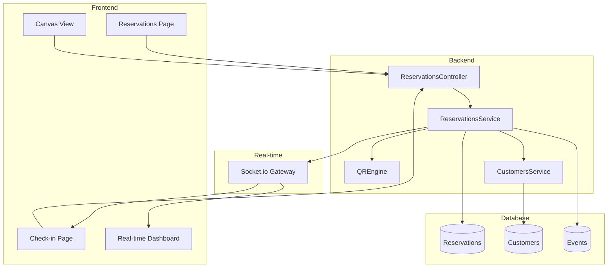

# Design Document - Reservation Module

## Overview

Rezervasyon Modülü, EventFlow PRO sisteminin temel operasyonel bileşenidir. Bu modül, etkinlik organizatörlerinin masa rezervasyonlarını yönetmesini, QR kod tabanlı biletleme sistemini ve kapı görevlileri için check-in operasyonlarını kapsar.

### Temel Özellikler

- Masa bazlı rezervasyon oluşturma ve yönetimi
- Benzersiz QR kod üretimi ve doğrulama
- Gerçek zamanlı check-in işlemleri
- CRM entegrasyonu ile müşteri geçmişi takibi
- Offline-first PWA desteği
- Socket.io ile canlı dashboard güncellemeleri

## Architecture



## Components and Interfaces

### Backend Components

#### ReservationsService

```typescript
interface IReservationsService {
  // CRUD Operations
  create(dto: CreateReservationDto): Promise<Reservation>;
  findAll(filters: ReservationFilters): Promise<Reservation[]>;
  findOne(id: string): Promise<Reservation>;
  update(id: string, dto: UpdateReservationDto): Promise<Reservation>;
  delete(id: string): Promise<void>;

  // Check-in Operations
  checkIn(qrCodeHash: string): Promise<CheckInResult>;
  findByQRCode(qrCodeHash: string): Promise<Reservation>;

  // Table Operations
  getByTable(eventId: string, tableId: string): Promise<Reservation | null>;
  isTableAvailable(eventId: string, tableId: string): Promise<boolean>;

  // Statistics
  getEventStats(eventId: string): Promise<EventStats>;
}
```

#### QREngine

```typescript
interface IQREngine {
  generateHash(eventId: string, tableId: string, customerId: string): string;
  generateQRCode(reservation: Reservation): Promise<QRCodeResult>;
  validateHash(hash: string): boolean;
  decodeQRData(qrData: string): QRDecodedData;
}
```

#### ReservationFilters

```typescript
interface ReservationFilters {
  eventId?: string;
  customerId?: string;
  status?: ReservationStatus;
  searchQuery?: string;
  tableId?: string;
}
```

### Frontend Components

#### ReservationStore (Zustand)

```typescript
interface ReservationStore {
  reservations: Reservation[];
  selectedReservation: Reservation | null;
  filters: ReservationFilters;
  isLoading: boolean;

  // Actions
  fetchReservations: (filters?: ReservationFilters) => Promise<void>;
  createReservation: (dto: CreateReservationDto) => Promise<Reservation>;
  updateReservation: (id: string, dto: UpdateReservationDto) => Promise<void>;
  cancelReservation: (id: string) => Promise<void>;
  setFilters: (filters: ReservationFilters) => void;
}
```

#### CheckInStore (Zustand)

```typescript
interface CheckInStore {
  stats: EventStats;
  recentCheckIns: CheckInRecord[];
  offlineQueue: OfflineCheckIn[];
  isOnline: boolean;

  // Actions
  performCheckIn: (qrCodeHash: string) => Promise<CheckInResult>;
  syncOfflineQueue: () => Promise<void>;
  subscribeToUpdates: (eventId: string) => void;
}
```

## Data Models

### Reservation Entity (Mevcut + Güncellemeler)

```typescript
interface Reservation {
  id: string;
  eventId: string;
  tableId: string;
  customerId: string;
  guestCount: number;
  qrCodeHash: string;
  status: ReservationStatus;
  checkInTime: Date | null;
  specialRequests: string | null;
  totalAmount: number;
  isPaid: boolean;
  createdAt: Date;
  updatedAt: Date;

  // Relations
  event?: Event;
  customer?: Customer;
}

enum ReservationStatus {
  PENDING = "pending",
  CONFIRMED = "confirmed",
  CHECKED_IN = "checked_in",
  CANCELLED = "cancelled",
  NO_SHOW = "no_show",
}
```

### CheckInResult

```typescript
interface CheckInResult {
  success: boolean;
  message: string;
  reservation?: Reservation;
  tableLocation?: {
    x: number;
    y: number;
    label: string;
  };
}
```

### EventStats

```typescript
interface EventStats {
  totalExpected: number;
  checkedIn: number;
  remaining: number;
  cancelled: number;
  noShow: number;
}
```

### OfflineCheckIn

```typescript
interface OfflineCheckIn {
  id: string;
  qrCodeHash: string;
  timestamp: Date;
  synced: boolean;
}
```

## Correctness Properties

_A property is a characteristic or behavior that should hold true across all valid executions of a system-essentially, a formal statement about what the system should do. Properties serve as the bridge between human-readable specifications and machine-verifiable correctness guarantees._

### Property 1: Guest count validation against table capacity

_For any_ reservation creation or update request, if the guestCount exceeds the table's capacity, the system should reject the request with a validation error.
**Validates: Requirements 1.2, 2.1**

### Property 2: Table availability enforcement

_For any_ event and table combination, if a non-cancelled reservation exists for that table, creating a new reservation for the same table should be rejected.
**Validates: Requirements 1.3, 2.2**

### Property 3: QR code uniqueness

_For any_ two distinct reservations, their qrCodeHash values should be different.
**Validates: Requirements 1.4**

### Property 4: Customer association correctness

_For any_ created reservation, the customerId should reference a valid customer in the database, and the customer relation should be correctly loaded.
**Validates: Requirements 1.5**

### Property 5: Cancellation frees table

_For any_ reservation that is cancelled, the same table should become available for new reservations.
**Validates: Requirements 2.3**

### Property 6: QR code preservation on update

_For any_ reservation update operation, the qrCodeHash should remain unchanged from its original value.
**Validates: Requirements 2.4**

### Property 7: QR code generation consistency (Idempotence)

_For any_ reservation, calling generateQRCode multiple times should return the same QR code data URL.
**Validates: Requirements 3.4**

### Property 8: QR code content completeness

_For any_ generated QR code, when decoded, it should contain eventId, tableId, and qrCodeHash fields.
**Validates: Requirements 3.2**

### Property 9: Valid QR lookup returns reservation

_For any_ valid qrCodeHash, findByQRCode should return the corresponding reservation with all relations loaded.
**Validates: Requirements 4.1**

### Property 10: Check-in updates status and time

_For any_ successful check-in operation, the reservation status should be updated to CHECKED_IN and checkInTime should be set to a non-null timestamp.
**Validates: Requirements 4.2**

### Property 11: Invalid check-in rejection

_For any_ reservation with status CHECKED_IN or CANCELLED, attempting check-in should be rejected with an appropriate error message.
**Validates: Requirements 4.3, 4.4**

### Property 12: Dashboard statistics calculation

_For any_ event, the sum of checkedIn, remaining, cancelled, and noShow should equal totalExpected.
**Validates: Requirements 5.1**

### Property 13: Offline queue persistence

_For any_ check-in performed while offline, the operation should be queued and successfully synced when connection is restored.
**Validates: Requirements 5.4**

### Property 14: Customer history retrieval

_For any_ valid customerId, the CRM integration should return the customer's event history and VIP score.
**Validates: Requirements 6.1**

### Property 15: Blacklist warning

_For any_ customer with isBlacklisted=true, the system should return a warning flag when the customer is selected.
**Validates: Requirements 6.2**

### Property 16: Search returns matching results

_For any_ search query, all returned reservations should have customer name or phone number containing the search string (case-insensitive partial match).
**Validates: Requirements 7.1, 7.2**

### Property 17: Filter returns correct subset

_For any_ status or event filter, all returned reservations should match the specified filter criteria exactly.
**Validates: Requirements 7.3, 7.4**

## Error Handling

### Backend Error Handling

```typescript
// Özel exception sınıfları
class ReservationNotFoundException extends NotFoundException {
  constructor(id: string) {
    super(`Rezervasyon bulunamadı: ${id}`);
  }
}

class TableNotAvailableException extends BadRequestException {
  constructor(tableId: string) {
    super(`Bu masa zaten rezerve edilmiş: ${tableId}`);
  }
}

class CapacityExceededException extends BadRequestException {
  constructor(guestCount: number, capacity: number) {
    super(
      `Misafir sayısı (${guestCount}) masa kapasitesini (${capacity}) aşıyor`
    );
  }
}

class InvalidCheckInException extends BadRequestException {
  constructor(status: ReservationStatus) {
    super(`Bu rezervasyon için check-in yapılamaz. Durum: ${status}`);
  }
}

class InvalidQRCodeException extends BadRequestException {
  constructor() {
    super("Geçersiz QR kod");
  }
}
```

### Frontend Error Handling

```typescript
// API hata yakalama
const handleApiError = (error: AxiosError) => {
  const message = error.response?.data?.message || "Bir hata oluştu";
  toast.error(message);

  // Offline durumunda queue'ya ekle
  if (!navigator.onLine) {
    offlineQueue.add(error.config);
  }
};
```

## Testing Strategy

### Unit Testing

- Jest framework kullanılacak
- Her service metodu için birim testleri
- Mock repository pattern ile veritabanı izolasyonu
- DTO validasyon testleri

### Property-Based Testing

- **fast-check** kütüphanesi kullanılacak (TypeScript için en uygun PBT kütüphanesi)
- Her correctness property için minimum 100 iterasyon
- Rastgele veri üretimi için custom arbitraries

```typescript
// Örnek PBT yapısı
import * as fc from "fast-check";

// Reservation arbitrary
const reservationArb = fc.record({
  eventId: fc.uuid(),
  tableId: fc.string({ minLength: 1, maxLength: 20 }),
  customerId: fc.uuid(),
  guestCount: fc.integer({ min: 1, max: 20 }),
});

// Table arbitrary
const tableArb = fc.record({
  id: fc.string({ minLength: 1, maxLength: 20 }),
  capacity: fc.integer({ min: 1, max: 20 }),
});
```

### Integration Testing

- Supertest ile API endpoint testleri
- Test veritabanı ile gerçek veritabanı işlemleri
- Socket.io event testleri

### E2E Testing

- Playwright ile frontend akış testleri
- QR kod okuma simülasyonu
- Offline/online geçiş senaryoları
