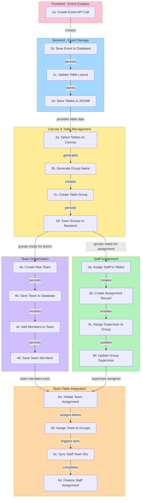
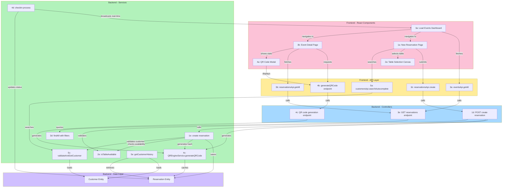
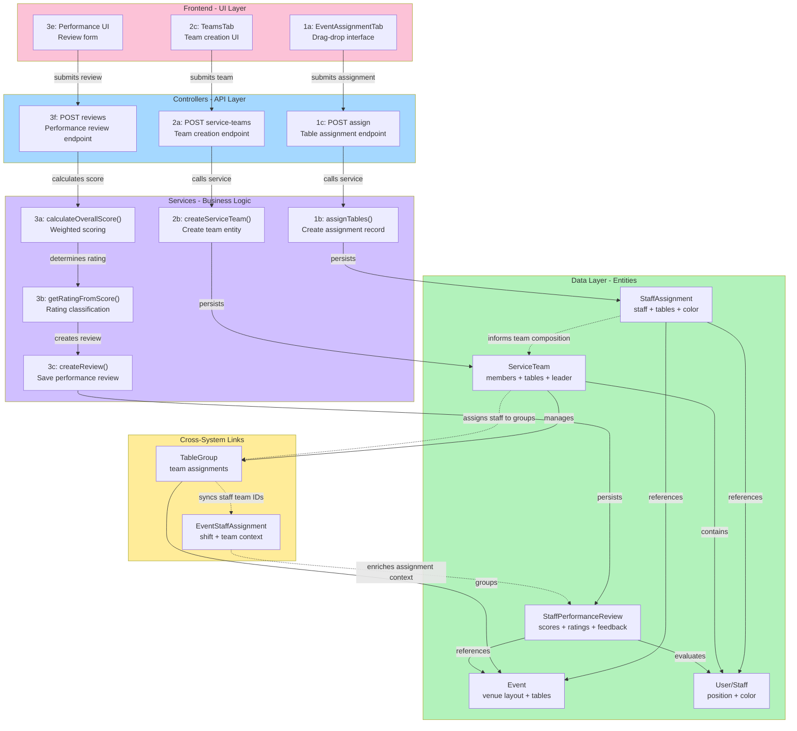

# EventFlow PRO - Etkinlik Oluşturma ve Ekip Organizasyonu Codemap

> Kaynak: https://windsurf.com/codemaps/4f7c8a9c-5457-4b93-951a-3b4c73660e4f-dd50dfbd30f84514

## Genel Bakış

EventFlow PRO sisteminde etkinlik oluşturma, görsel masa yerleşimi, personel atama ve ekip organizasyonu süreçlerini kapsayan kod haritası.

**Ana Akış:**
`[1a]` etkinlik oluşturma → `[1c]` masa düzeni kaydetme → `[2c]` masa gruplama → `[3a]` personel atama → `[4a]` ekip oluşturma → `[5b]` tam ekip yapısı kurma

---

## 1. Etkinlik Oluşturma ve Masa Yerleşimi

Frontend formdan backend'e etkinlik oluşturma ve masa düzenini kaydetme süreci.

### Akış Diyagramı

```
Frontend Etkinlik Formu
        ↓
[1a] Etkinlik Oluşturma API Çağrısı
     page.tsx:45 → await eventsApi.create(dto);
        ↓
Backend Events Controller
        ↓
     eventsService.create() yönlendirme
        ↓
Events Service Katmanı
        ↓
[1b] Etkinlik Veritabanına Kaydedilir
     events.service.ts:33 → const savedEvent = await this.eventRepository.save(event);
        ↓
Masa Yerleşimi Güncelleme
        ↓
     eventsService.updateLayout() çağrı
        ↓
[1c] Masa Yerleşimi Güncellenir
     events.service.ts:140 → event.venueLayout = dto.venueLayout as any;
        ↓
Veritabanı Entity Katmanı
        ↓
[1d] Masa Verileri JSON Formatında Saklanır
     event.entity.ts:46 → venueLayout: { tables: Array<{...}>; walls: Array<{...}>; stage: {...}; dimensions: {...}; };
```

### Önemli Kod Referansları

| Adım | Dosya             | Satır | Kod                                                          |
| ---- | ----------------- | ----- | ------------------------------------------------------------ |
| 1a   | page.tsx          | 45    | `await eventsApi.create(dto);`                               |
| 1b   | events.service.ts | 33    | `const savedEvent = await this.eventRepository.save(event);` |
| 1c   | events.service.ts | 140   | `event.venueLayout = dto.venueLayout as any;`                |
| 1d   | event.entity.ts   | 46    | `venueLayout: { tables, walls, stage, dimensions }`          |

---

## 2. Görsel Masa Yönetimi ve Gruplama

React-Konva canvas üzerinde masa düzenleme ve gruplama işlemleri.

### Akış Diyagramı

```
Canvas Masa Seçimi
        ↓
[2a] Masa Seçimi İşlenir
     EventCanvas.tsx:262 → handleTableClick(table, e)
        ↓
     Masa seçimi state güncellenir
        ↓
     Seçili masalar toplanır
        ↓
[2b] Otomatik Grup Adı Oluşturulur
     EventAssignmentTab.tsx:616 → const autoName = generateAutoGroupName(selectedTableIds);
        ↓
     Seçili masa numaraları alınır
        ↓
Masa Grubu Oluşturma
        ↓
     newGroup objesi oluşturulur
        ↓
[2c] Masa Grubu Oluşturulur
     EventAssignmentTab.tsx:637 → setTableGroups((prev) => [...prev, newGroup]);
        ↓
     Grup local state'e eklenir
        ↓
     UI'da grup görünür hale gelir
        ↓
Backend Kayıt İşlemi
        ↓
[2d] Gruplar Backend'e Kaydedilir
     EventAssignmentTab.tsx:974 → await staffApi.saveEventTableGroups(eventId, tableGroups.map(...));
        ↓
     staffService.saveEventTableGroups()
        ↓
     TableGroup entity kaydedilir
```

### Önemli Kod Referansları

| Adım | Dosya                  | Satır | Kod                                                                   |
| ---- | ---------------------- | ----- | --------------------------------------------------------------------- |
| 2a   | EventCanvas.tsx        | 262   | `handleTableClick(table: TableInstance, e: Konva.KonvaEventObject)`   |
| 2b   | EventAssignmentTab.tsx | 616   | `const autoName = generateAutoGroupName(selectedTableIds);`           |
| 2c   | EventAssignmentTab.tsx | 637   | `setTableGroups((prev) => [...prev, newGroup]);`                      |
| 2d   | EventAssignmentTab.tsx | 974   | `await staffApi.saveEventTableGroups(eventId, tableGroups.map(...));` |

---

## 3. Personel Atama ve Masa Görevleri

Personellerin masalara ve gruplara atanma süreci.

### Akış Diyagramı

```
Staff Assignment Panel
        ↓
     Personel listesi ve masalar
        ↓
[3a] Personel Masalara Atanır
     EventAssignmentTab.tsx:769 → await staffApi.assignStaffToTables(eventId, { staffId, tableIds, ... });
        ↓
     API isteği gönderilir
        ↓
[3b] Personel Ataması Oluşturulur
     staff.service.ts:271 → assignment = this.assignmentRepository.create({ eventId, staffId, assignedTableIds, color });
        ↓
     Local state güncellenir
        ↓
[3c] Süpervizör Gruba Atanır
     EventAssignmentTab.tsx:712 → handleSupervisorDrop(supervisor: Staff, targetGroupId: string)
        ↓
     Drag-drop ile süpervizör seçilir
        ↓
[3d] Grup Süpervizör Güncellenir
     EventAssignmentTab.tsx:719 → group.assignedSupervisorId = supervisor.id; group.color = supervisor.color;
        ↓
     Grup rengi süpervizör rengi yapılır
```

### Önemli Kod Referansları

| Adım | Dosya                  | Satır | Kod                                                                                             |
| ---- | ---------------------- | ----- | ----------------------------------------------------------------------------------------------- |
| 3a   | EventAssignmentTab.tsx | 769   | `await staffApi.assignStaffToTables(eventId, { staffId, tableIds, ... });`                      |
| 3b   | staff.service.ts       | 271   | `assignment = this.assignmentRepository.create({ eventId, staffId, assignedTableIds, color });` |
| 3c   | EventAssignmentTab.tsx | 712   | `handleSupervisorDrop(supervisor: Staff, targetGroupId: string)`                                |
| 3d   | EventAssignmentTab.tsx | 719   | `group.assignedSupervisorId = supervisor.id; group.color = supervisor.color;`                   |

---

## 4. Ekip Oluşturma ve Organizasyonu

Service team oluşturma ve personel ekiplere ekleme süreci.

### Akış Diyagramı

```
Frontend Ekip Oluşturma Formu
        ↓
[4a] Yeni Ekip Oluşturulur
     TeamsTab.tsx:603 → await staffApi.createTeam({ name, color, leaderId, memberIds });
        ↓
     staffApi.createTeam() çağrısı
        ↓
Backend Ekip Yönetimi
        ↓
[4b] Ekip Veritabanına Kaydedilir
     staff.service.ts:528 → const team = this.serviceTeamRepository.create({ eventId, name, color, members, leaderId, tableIds });
        ↓
     serviceTeamRepository.create()
        ↓
     Ekip veritabanına kayıt
        ↓
Üye Ekleme Modalı
        ↓
     Personel Seçimi
        ↓
[4c] Üye Ekibe Eklenir
     TeamsTab.tsx:161 → await staffApi.addMemberToTeam(teamId, { memberId: staff.id });
        ↓
     staffApi.addMemberToTeam()
        ↓
[4d] Ekip Üyesi Kaydedilir
     staff.service.ts:576 → team.members.push(member); return this.serviceTeamRepository.save(team);
        ↓
     serviceTeamRepository.save()
```

### Önemli Kod Referansları

| Adım | Dosya            | Satır | Kod                                                                                                      |
| ---- | ---------------- | ----- | -------------------------------------------------------------------------------------------------------- |
| 4a   | TeamsTab.tsx     | 603   | `await staffApi.createTeam({ name, color, leaderId, memberIds });`                                       |
| 4b   | staff.service.ts | 528   | `const team = this.serviceTeamRepository.create({ eventId, name, color, members, leaderId, tableIds });` |
| 4c   | TeamsTab.tsx     | 161   | `await staffApi.addMemberToTeam(teamId, { memberId: staff.id });`                                        |
| 4d   | staff.service.ts | 576   | `team.members.push(member); return this.serviceTeamRepository.save(team);`                               |

---

## 5. Ekip-Masa Grubu Entegrasyonu

Oluşturulan ekiplerin masa gruplarına atanması ve tam ekip yapısı oluşturma.

### Akış Diyagramı

```
[5a] Ekibe Atama Başlatılır
     EventAssignmentTab.tsx:870 → handleAssignToTeam()
        ↓
     Seçili masaların grupları bulunur
        ↓
     affectedGroupIds hesaplanır
        ↓
[5b] Gruplara Ekip Atanır
     EventAssignmentTab.tsx:890 → setTableGroups((prev) => prev.map((group) => {
       if (affectedGroupIds.has(group.id)) {
         return { ...group, assignedTeamId: selectedTeamId, color: team.color };
       }
       return group;
     }));
        ↓
     Grup renkleri güncellenir
        ↓
     Yeni grup oluşturma (gerekirse)
        ↓
     Backend'e kaydetme işlemi
        ↓
     saveEventTableGroups() çağrılır
        ↓
[5c] Personel Ekip ID'si Güncellenir
     staff.service.ts:876 → await this.syncStaffTeamIdByTableGroup(eventId, group.tableIds, teamId);
        ↓
     Personel atamaları bulunur
        ↓
     getEventStaffAssignments()
        ↓
[5d] Personel Ataması Tamamlanır
     staff.service.ts:922 → assignment.teamId = teamId; await this.eventStaffAssignmentRepository.save(assignment);
        ↓
     eventStaffAssignmentRepository.save()
```

### Önemli Kod Referansları

| Adım | Dosya                  | Satır | Kod                                                                                       |
| ---- | ---------------------- | ----- | ----------------------------------------------------------------------------------------- |
| 5a   | EventAssignmentTab.tsx | 870   | `handleAssignToTeam()`                                                                    |
| 5b   | EventAssignmentTab.tsx | 890   | `setTableGroups((prev) => prev.map(...))`                                                 |
| 5c   | staff.service.ts       | 876   | `await this.syncStaffTeamIdByTableGroup(eventId, group.tableIds, teamId);`                |
| 5d   | staff.service.ts       | 922   | `assignment.teamId = teamId; await this.eventStaffAssignmentRepository.save(assignment);` |

---

## Dosya Referansları

### Frontend Dosyaları

| Dosya                  | Konum                        | Açıklama                    |
| ---------------------- | ---------------------------- | --------------------------- |
| page.tsx               | frontend/src/app/events/new/ | Etkinlik oluşturma sayfası  |
| EventCanvas.tsx        | frontend/src/components/     | React-Konva canvas bileşeni |
| EventAssignmentTab.tsx | frontend/src/components/     | Personel atama tab'ı        |
| TeamsTab.tsx           | frontend/src/components/     | Ekip yönetimi tab'ı         |

### Backend Dosyaları

| Dosya                | Konum                        | Açıklama              |
| -------------------- | ---------------------------- | --------------------- |
| events.service.ts    | backend/src/events/          | Etkinlik servisi      |
| events.controller.ts | backend/src/events/          | Etkinlik controller'ı |
| event.entity.ts      | backend/src/events/entities/ | Etkinlik entity'si    |
| staff.service.ts     | backend/src/staff/           | Personel servisi      |

---

## Teknoloji Stack

| Katman             | Teknoloji                |
| ------------------ | ------------------------ |
| Frontend Framework | Next.js (App Router)     |
| UI Library         | React                    |
| Canvas             | React-Konva              |
| State Management   | React useState/useEffect |
| Backend Framework  | NestJS                   |
| ORM                | TypeORM                  |
| Database           | PostgreSQL               |
| API Pattern        | REST                     |

---

## Veri Modelleri

### Event Entity

```typescript
{
  id: string;
  name: string;
  date: Date;
  venueLayout: {
    tables: Array<TableInstance>;
    walls: Array<WallInstance>;
    stage: StageInstance;
    dimensions: {
      width: number;
      height: number;
    }
  }
}
```

### TableGroup

```typescript
{
  id: string;
  name: string;
  tableIds: string[];
  assignedSupervisorId?: string;
  assignedTeamId?: string;
  color: string;
}
```

### EventStaffAssignment

```typescript
{
  id: string;
  eventId: string;
  staffId: string;
  assignedTableIds: string[];
  teamId?: string;
  color: string;
}
```

### ServiceTeam

```typescript
{
  id: string;
  eventId: string;
  name: string;
  color: string;
  leaderId?: string;
  members: Staff[];
  tableIds: string[];
}
```

---

# Event Staff Management System: Assignment, Organization & Performance

> Kaynak: https://windsurf.com/codemaps/e1ff23ef-91d9-4b02-bbdc-0748ff5ef0b9-dd50dfbd30f84514

## Genel Bakış

Event Staff Management System - personel atamalarını `[1b]`, servis ekip organizasyonunu `[2c]` ve performans değerlendirme iş akışlarını `[3d]` kapsayan kod haritası. Sistem, kapsamlı personel yönetimi için frontend drag-and-drop arayüzlerini backend servis katmanlarıyla entegre eder.

---

## 1. Staff Table Assignment Flow

Individual staff assignment to event tables with automatic color coding and validation.

### Akış Diyagramı

```
Frontend Assignment UI
        ↓
[1c] Assignment API Endpoint
     staff.controller.ts:151 → @Post('assign') assignTables(@Body() dto: AssignTablesDto)
        ↓
     staff.controller.ts
        ↓
[1d] Controller Service Call
     staff.controller.ts:153 → await this.assignTables(dto.eventId, dto.staffId, dto.tableIds, dto.color)
        ↓
     staff.service.ts
        ↓
[1a] Assignment Service Method
     staff.service.ts:249 → assignTables(eventId, staffId, tableIds, color?)
        ↓
[1b] Create Assignment Entity
     staff.service.ts:271 → assignment = this.assignmentRepository.create({ eventId, staffId, assignedTableIds, color })
        ↓
Database Storage → staff_assignments table
```

### Önemli Kod Referansları

| Adım | Dosya               | Satır | Kod                                                                                            |
| ---- | ------------------- | ----- | ---------------------------------------------------------------------------------------------- |
| 1a   | staff.service.ts    | 249   | `assignTables(eventId: string, staffId: string, tableIds: string[], color?: string)`           |
| 1b   | staff.service.ts    | 271   | `assignment = this.assignmentRepository.create({ eventId, staffId, assignedTableIds, color })` |
| 1c   | staff.controller.ts | 151   | `@Post('assign') assignTables(@Body() dto: AssignTablesDto)`                                   |
| 1d   | staff.controller.ts | 153   | `await this.assignTables(dto.eventId, dto.staffId, dto.tableIds, dto.color)`                   |

---

## 2. Service Team Organization Flow

Event-based team creation with member management and table assignments.

### Akış Diyagramı

```
Frontend Team Creation Request
        ↓
[2c] Team Creation Endpoint
     staff.controller.ts:236 → @Post('service-teams') createServiceTeam(@Body() dto)
        ↓
     staffController.createServiceTeam()
        ↓
[2a] Team Creation Service
     staff.service.ts:520 → createServiceTeam(dto: { eventId, name, color, members?, leaderId?, tableIds? })
        ↓
     Validate team data
        ↓
[2b] Team Entity Creation
     staff.service.ts:528 → const team = this.serviceTeamRepository.create({ eventId, name, color, members, leaderId, tableIds })
        ↓
     Save to database
        ↓
Table Assignment to Teams
        ↓
     POST /staff/service-teams/:id/tables
        ↓
[2d] Table Assignment to Teams
     staff.service.ts:597 → assignTablesToServiceTeam(teamId, tableIds): Promise<ServiceTeam>
        ↓
     Find existing team assignments → Remove tables from other teams → Add tables to target team
        ↓
Team Member Management
     Add members via POST /staff/service-teams/:id/members
     Remove members via DELETE endpoint
```

### Önemli Kod Referansları

| Adım | Dosya               | Satır | Kod                                                                                                     |
| ---- | ------------------- | ----- | ------------------------------------------------------------------------------------------------------- |
| 2a   | staff.service.ts    | 520   | `createServiceTeam(dto: { eventId, name, color, members?, leaderId?, tableIds? })`                      |
| 2b   | staff.service.ts    | 528   | `const team = this.serviceTeamRepository.create({ eventId, name, color, members, leaderId, tableIds })` |
| 2c   | staff.controller.ts | 236   | `@Post('service-teams') createServiceTeam(@Body() dto)`                                                 |
| 2d   | staff.service.ts    | 597   | `assignTablesToServiceTeam(teamId: string, tableIds: string[]): Promise<ServiceTeam>`                   |

---

## 3. Staff Performance Review Flow

Performance evaluation system with category scoring and automated rating calculation.

### Akış Diyagramı

```
Leader Controller Entry Point
        ↓
[3e] Performance Review API
     leader.controller.ts:91 → @Post('reviews') createReview(@Request() req, @Body() dto)
        ↓
Leader Service Layer
        ↓
     createReview() called → Permission validation
        ↓
[3a] Score Calculation Logic
     leader.service.ts:23 → function calculateOverallScore(categoryScores: CategoryScores): number
        ↓
     Weighted category scoring
        ↓
[3b] Rating Classification
     leader.service.ts:50 → function getRatingFromScore(score: number): PerformanceRating
        ↓
     Score to rating mapping
        ↓
[3c] Review Creation Service
     leader.service.ts:334 → createReview(reviewerId, dto: { staffId, eventId, score?, rating?, categoryScores? })
        ↓
     Input validation → Score/rating auto-calc → Review entity save
        ↓
[3d] Automated Score Processing
     leader.service.ts:361 → if (dto.categoryScores) { score = calculateOverallScore(dto.categoryScores); rating = getRatingFromScore(score); }
        ↓
     Auto-calc from categories → Database persistence → StaffPerformanceReview entity
```

### Önemli Kod Referansları

| Adım | Dosya                | Satır | Kod                                                                                                 |
| ---- | -------------------- | ----- | --------------------------------------------------------------------------------------------------- |
| 3a   | leader.service.ts    | 23    | `function calculateOverallScore(categoryScores: CategoryScores): number`                            |
| 3b   | leader.service.ts    | 50    | `function getRatingFromScore(score: number): PerformanceRating`                                     |
| 3c   | leader.service.ts    | 334   | `createReview(reviewerId, dto)`                                                                     |
| 3d   | leader.service.ts    | 361   | `if (dto.categoryScores) { score = calculateOverallScore(...); rating = getRatingFromScore(...); }` |
| 3e   | leader.controller.ts | 91    | `@Post('reviews') createReview(@Request() req, @Body() dto)`                                        |

### Dosya Referansları

| Dosya                      | Açıklama                                  |
| -------------------------- | ----------------------------------------- |
| staff.service.ts           | Personel servisi - atama ve ekip yönetimi |
| staff.controller.ts        | Personel controller'ı                     |
| EventAssignmentTab.tsx     | Frontend atama tab'ı                      |
| staff-assignment.entity.ts | Atama entity'si                           |
| TeamsTab.tsx               | Ekip yönetimi UI                          |
| leader.service.ts          | Lider servisi - performans değerlendirme  |
| leader.controller.ts       | Lider controller'ı                        |

---

# EventFlow Reservations Module Architecture

> Kaynak: https://windsurf.com/codemaps/c3e0f1f3-8ceb-4a06-a3aa-d4fca9e0d921-dd50dfbd30f84514

## Genel Bakış

Complete reservations module architecture spanning frontend React components, API integration, and NestJS backend services.

**Ana Akışlar:**

- Multi-step reservation creation `[1a-1f]`
- Interactive table selection `[2a-2e]`
- Dashboard management `[3a-3e]`
- QR code check-in system `[4a-4f]`
- CRM integration `[5a-5e]`

---

## 1. New Reservation Creation Flow

Multi-step reservation creation from guest info to table selection to confirmation.

### Akış Diyagramı

```
[1a] Frontend Confirmation Handler
     page.tsx:223 → const handleConfirm = async () => {
        ↓
[1b] API Call to Create Reservation
     page.tsx:230 → const response = await reservationsApi.create({
        ↓
[1c] API Endpoint Definition
     api.ts:190 → create: (data: {
        ↓
[1d] Backend POST Endpoint
     reservations.controller.ts:40 → @Post()
        ↓
[1e] Service Layer Creation Logic
     reservations.service.ts:137 → create(dto: CreateReservationDto): Promise<Reservation> {
        ↓
     Customer validation → Table availability check
        ↓
[1f] QR Hash Generation
     reservations.service.ts:192 → const qrCodeHash = await this.qrEngineService.generateHash(
        ↓
     Response with reservation data → QR code generation request
```

### Önemli Kod Referansları

| Adım | Dosya                      | Satır | Kod                                                           |
| ---- | -------------------------- | ----- | ------------------------------------------------------------- |
| 1a   | page.tsx                   | 223   | `const handleConfirm = async () => {`                         |
| 1b   | page.tsx                   | 230   | `const response = await reservationsApi.create({`             |
| 1c   | api.ts                     | 190   | `create: (data: {`                                            |
| 1d   | reservations.controller.ts | 40    | `@Post()`                                                     |
| 1e   | reservations.service.ts    | 137   | `create(dto: CreateReservationDto): Promise<Reservation> {`   |
| 1f   | reservations.service.ts    | 192   | `const qrCodeHash = await this.qrEngineService.generateHash(` |

---

## 2. Interactive Table Selection Process

Canvas-based table selection with real-time availability visualization.

### Akış Diyagramı

```
Table Selection Canvas Component
        ↓
     User interacts with canvas
        ↓
[2a] Table Click Handler
     TableSelectionCanvas.tsx:144 → const handleTableClick = (table: TableInstance) => {
        ↓
[2b] Availability Check
     TableSelectionCanvas.tsx:145 → const isReserved = reservedTableIds.includes(table.id);
        ↓
[2c] Table Selection Callback
     TableSelectionCanvas.tsx:147 → onSelectTable(table.id, table.capacity);
        ↓
     Updates selectedTableId state
        ↓
Visual table rendering:
     🟢 Green tables (available)
     🔴 Red tables (reserved)
     🔵 Blue table (selected)
        ↓
[2d] Load Existing Reservations
     page.tsx:106 → const reservationsRes = await reservationsApi.getAll({ eventId });
        ↓
Backend validation on creation
        ↓
[2e] Backend Availability Validation
     reservations.service.ts:67 → async isTableAvailable(
        ↓
     Query database for existing → Return boolean availability
```

### Önemli Kod Referansları

| Adım | Dosya                    | Satır | Kod                                                                  |
| ---- | ------------------------ | ----- | -------------------------------------------------------------------- |
| 2a   | TableSelectionCanvas.tsx | 144   | `const handleTableClick = (table: TableInstance) => {`               |
| 2b   | TableSelectionCanvas.tsx | 145   | `const isReserved = reservedTableIds.includes(table.id);`            |
| 2c   | TableSelectionCanvas.tsx | 147   | `onSelectTable(table.id, table.capacity);`                           |
| 2d   | page.tsx                 | 106   | `const reservationsRes = await reservationsApi.getAll({ eventId });` |
| 2e   | reservations.service.ts  | 67    | `async isTableAvailable(`                                            |

---

## 3. Reservation Dashboard & Management

Event selection, reservation listing, filtering and statistics display.

### Akış Diyagramı

```
Main Dashboard Entry Point
        ↓
[3a] Load Events for Dashboard
     page.tsx:129 → const eventsRes = await eventsApi.getAll();
        ↓
     Filter upcoming events only → Display event cards with stats
        ↓
Event Detail Page Entry
        ↓
[3b] Load Event Reservations
     page.tsx:175 → const [eventRes, reservationsRes] = await Promise.all([
        ↓
     Load single event details → Load event reservations
        ↓
[3c] Client-side Filtering
     page.tsx:193 → const filteredReservations = useMemo(() => {
        ↓
     Filter by status dropdown → Filter by search query → Calculate statistics
        ↓
Backend API Layer
        ↓
[3e] GET All Reservations Endpoint
     reservations.controller.ts:50 → @Get()
        ↓
     Extract query parameters
        ↓
[3d] Backend Query Builder
     reservations.service.ts:302 → return this.reservationRepository
        ↓
     Join with customer & event → Apply dynamic filters → Return filtered results
```

### Önemli Kod Referansları

| Adım | Dosya                      | Satır | Kod                                                       |
| ---- | -------------------------- | ----- | --------------------------------------------------------- |
| 3a   | page.tsx                   | 129   | `const eventsRes = await eventsApi.getAll();`             |
| 3b   | page.tsx                   | 175   | `const [eventRes, reservationsRes] = await Promise.all([` |
| 3c   | page.tsx                   | 193   | `const filteredReservations = useMemo(() => {`            |
| 3d   | reservations.service.ts    | 302   | `return this.reservationRepository`                       |
| 3e   | reservations.controller.ts | 50    | `@Get()`                                                  |

---

## 4. QR Code Generation & Check-in Process

QR code creation, caching, and check-in validation flow.

### Akış Diyagramı

```
Frontend Reservation Detail View
        ↓
[4a] Request QR Code
     page.tsx:614 → reservationsApi.generateQRCode(reservation.id)
        ↓
     API call to generate QR code
        ↓
[4b] QR Code API Call
     api.ts:234 → generateQRCode: (id: string) =>
        ↓
     POST /reservations/:id/qrcode
        ↓
Backend QR Code Service
        ↓
     Controller receives request
        ↓
[4c] QR Code Generation Service
     qr-engine.service.ts:153 → async generateQRCode(reservation: Reservation): Promise<QRCodeResult> {
        ↓
     Check cache for idempotence → Generate new QR if needed
        ↓
QR Engine Service
        ↓
     Create QR content with hash → Return data URL to frontend
        ↓
Check-in Process
        ↓
     Public endpoint receives hash
        ↓
[4d] Check-in Process
     reservations.service.ts:533 → checkIn(qrCodeHash: string): Promise<{
        ↓
     Find reservation by hash
        ↓
[4e] Status Update
     reservations.service.ts:552 → reservation.status = ReservationStatus.CHECKED_IN;
        ↓
[4f] Real-time Update Broadcast
     reservations.service.ts:603 → this.realtimeGateway.broadcastCheckInWithStats(
        ↓
Real-time Gateway → Socket.io broadcast to clients
```

### Önemli Kod Referansları

| Adım | Dosya                   | Satır | Kod                                                                       |
| ---- | ----------------------- | ----- | ------------------------------------------------------------------------- |
| 4a   | page.tsx                | 614   | `reservationsApi.generateQRCode(reservation.id)`                          |
| 4b   | api.ts                  | 234   | `generateQRCode: (id: string) =>`                                         |
| 4c   | qr-engine.service.ts    | 153   | `async generateQRCode(reservation: Reservation): Promise<QRCodeResult> {` |
| 4d   | reservations.service.ts | 533   | `checkIn(qrCodeHash: string): Promise<{`                                  |
| 4e   | reservations.service.ts | 552   | `reservation.status = ReservationStatus.CHECKED_IN;`                      |
| 4f   | reservations.service.ts | 603   | `this.realtimeGateway.broadcastCheckInWithStats(`                         |

---

## 5. Customer Integration & CRM Features

Customer lookup, history tracking, and CRM integration during reservation.

### Akış Diyagramı

```
User types in reservation form
        ↓
[5a] Customer Autocomplete Search
     page.tsx:132 → const response = await customersApi.searchAutocomplete(query, 5);
        ↓
     Customer search API response → Display autocomplete suggestions
        ↓
User selects existing customer
        ↓
[5b] Customer Selection
     page.tsx:153 → const handleSelectCustomer = async (customer: Customer) => {
        ↓
Reservation creation process
        ↓
     Frontend sends reservation data → Backend create() method called
        ↓
Backend customer validation
        ↓
[5c] Customer Validation
     reservations.service.ts:148 → customer = await this.validateAndGetCustomer(customerId);
        ↓
Customer statistics updated
        ↓
[5d] Customer Statistics Update
     reservations.service.ts:211 → customer.totalReservations = (customer.totalReservations || 0) + 1;
        ↓
CRM history retrieval (separate flow)
        ↓
[5e] Customer History Retrieval
     reservations.service.ts:668 → getCustomerHistory(customerId: string): Promise<{
```

### Önemli Kod Referansları

| Adım | Dosya                   | Satır | Kod                                                                 |
| ---- | ----------------------- | ----- | ------------------------------------------------------------------- | --- | -------- |
| 5a   | page.tsx                | 132   | `const response = await customersApi.searchAutocomplete(query, 5);` |
| 5b   | page.tsx                | 153   | `const handleSelectCustomer = async (customer: Customer) => {`      |
| 5c   | reservations.service.ts | 148   | `customer = await this.validateAndGetCustomer(customerId);`         |
| 5d   | reservations.service.ts | 211   | `customer.totalReservations = (customer.totalReservations           |     | 0) + 1;` |
| 5e   | reservations.service.ts | 668   | `getCustomerHistory(customerId: string): Promise<{`                 |

### Dosya Referansları

| Dosya                      | Açıklama                                       |
| -------------------------- | ---------------------------------------------- |
| page.tsx                   | Rezervasyon sayfaları (new, dashboard, detail) |
| api.ts                     | Frontend API client                            |
| reservations.controller.ts | Rezervasyon controller'ı                       |
| reservations.service.ts    | Rezervasyon servisi                            |
| TableSelectionCanvas.tsx   | Masa seçim canvas bileşeni                     |
| qr-engine.service.ts       | QR kod servisi                                 |

---

## Tüm Modüller Özet Tablosu

| Modül                      | Akışlar | Ana Dosyalar                                  |
| -------------------------- | ------- | --------------------------------------------- |
| **Etkinlik Oluşturma**     | 1a-1d   | page.tsx, events.service.ts, event.entity.ts  |
| **Masa Yönetimi**          | 2a-2d   | EventCanvas.tsx, EventAssignmentTab.tsx       |
| **Personel Atama**         | 3a-3d   | staff.service.ts, staff.controller.ts         |
| **Ekip Organizasyonu**     | 4a-4d   | TeamsTab.tsx, staff.service.ts                |
| **Ekip-Masa Entegrasyonu** | 5a-5d   | EventAssignmentTab.tsx, staff.service.ts      |
| **Staff Assignment**       | 1a-1d   | staff.service.ts, staff.controller.ts         |
| **Service Teams**          | 2a-2d   | staff.service.ts, TeamsTab.tsx                |
| **Performance Review**     | 3a-3e   | leader.service.ts, leader.controller.ts       |
| **Rezervasyon Oluşturma**  | 1a-1f   | page.tsx, reservations.service.ts             |
| **Masa Seçimi**            | 2a-2e   | TableSelectionCanvas.tsx                      |
| **Dashboard**              | 3a-3e   | page.tsx, reservations.service.ts             |
| **QR Check-in**            | 4a-4f   | qr-engine.service.ts, reservations.service.ts |
| **CRM Entegrasyonu**       | 5a-5e   | reservations.service.ts                       |

---

# Mermaid Akış Diyagramları

> Kaynak: etkinlik.txt

## 1. Event Creation & Team Organization Flow



---

## 2. Reservations Module Architecture



---

## 3. Staff Management System Architecture



---

## Renk Kodları

| Renk         | Katman                |
| ------------ | --------------------- |
| 🩷 `#fcc2d7`  | Frontend - UI Layer   |
| 🩵 `#a5d8ff`  | Backend - Controllers |
| 💜 `#d0bfff` | Backend - Services    |
| 💚 `#b2f2bb` | Data Layer - Entities |
| 💛 `#ffec99` | API Layer / Canvas    |
| 🧡 `#ffd8a8` | Integration Layer     |
